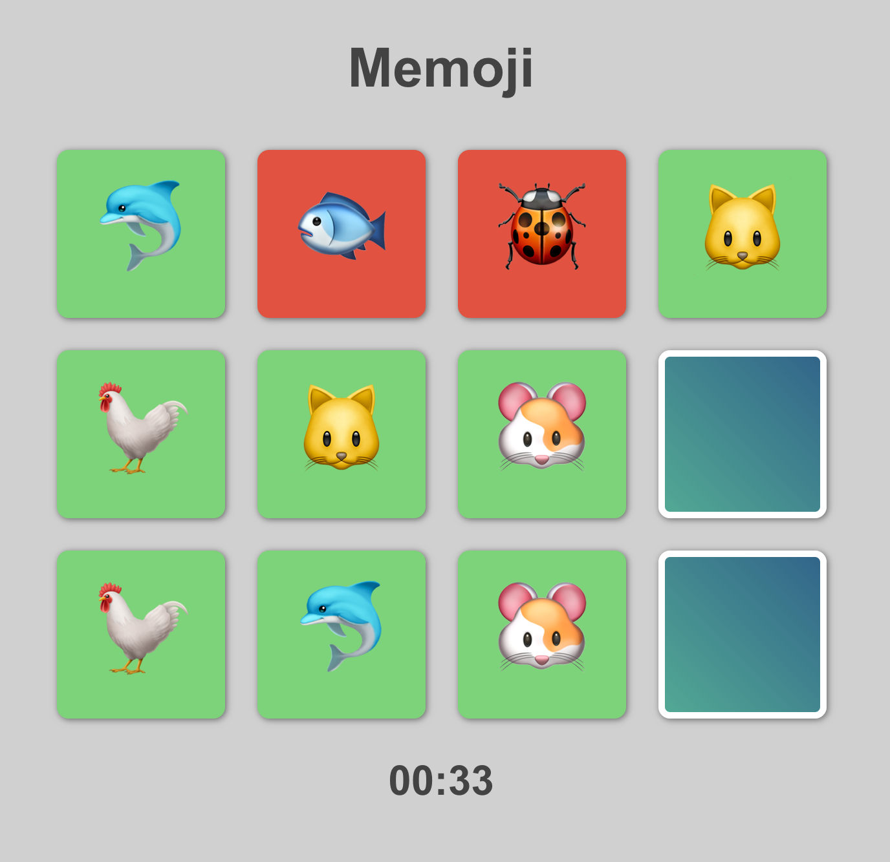

# Memoji game
Final project for the final course of Interface Development specialization from Yandex https://www.coursera.org/learn/razrabotka-interfeysov-proyekt

The goal of the game is to find all matching cards in specified time.

## Certificate
Specialization includes 5 courses: https://coursera.org/share/cccb5909b9eeead79cc21c042092db76

## Some features

On the top of script.js there are some variables like that:

const columnsCount = 4;

const rowsCount = 3;

const time = { m: 0, s: 30 };

let emojis = ['🐶', '🐱', '🐭', '🐹', '🐰', '🐻', '🐼', '🐨', '🐯', '🦁',
    '🐮', '🐷', '🐸', '🐙', '🐵', '🦄', '🐞', '🦀', '🐟',
    '🐊', '🐓', '🦃', '🐿', '🐬', '🐳', '🐋', '🐏', '🐑', '🐡'];

You can play with them around to create a mode which would be suitable for you. And also you can add your own emojis. Hopefully, I will create a menu for this parameters soon.

